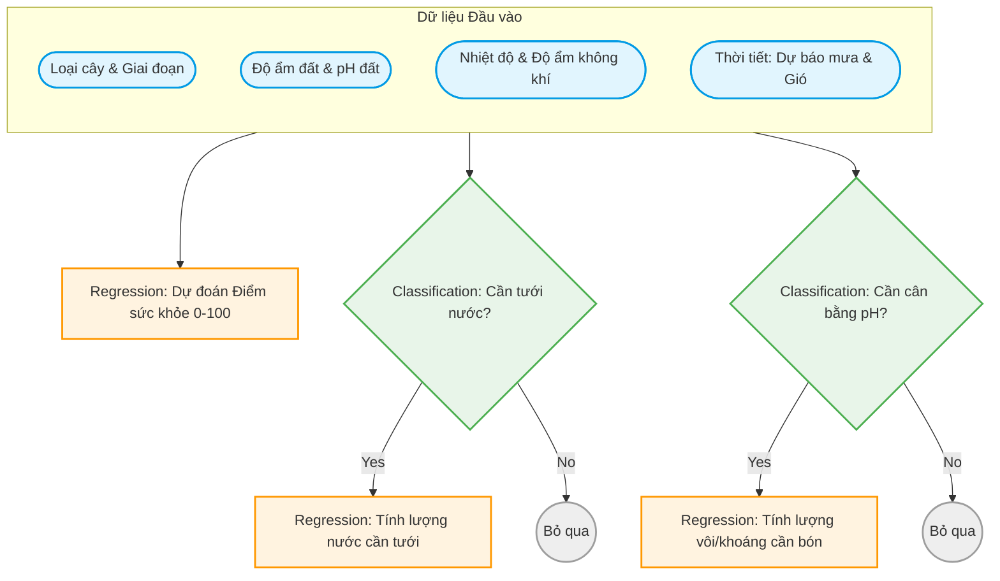

# Agriculture AIoT - Hệ Thống Nông Nghiệp Thông Minh

Dự án Agriculture AIoT cung cấp hệ thống phân tích và dự báo tự động nhằm tối ưu hóa hoạt động nông nghiệp. Hệ thống xử lý dữ liệu đo đạc từ các cảm biến thực địa để đưa ra đánh giá về sức khỏe cây trồng, khuyến nghị tưới tiêu và điều chỉnh độ pH của đất.

## 1. Sơ đồ Luồng Xử Lý (Mermaid Workflow)



---

## 2. Mô Tả Luồng Xử Lý & Thiết Kế Đặc Trưng

### 2.1 Tiền Xử Lý Dữ Liệu
Bộ tiền xử lý nằm trong tệp [src/data_loader.py](src/data_loader.py) đảm nhận vai trò:
*   Đọc và xử lý định dạng ngày tháng từ cảm biến (`timestamp`, `sowing_date`).
*   Tính toán giai đoạn phát triển (`growth_ratio`) bằng công thức: `growth_ratio = (timestamp - sowing_date) / total_days`.
*   Mã hóa cột phân loại `crop_type` (Wheat, Soybean, Cotton, Rice, Maize) sử dụng bộ mã hóa `OneHotEncoder` được lưu trữ tại `models/preprocessor.pkl`.

### 2.2 Các Nhánh Nghiệp Vụ AI/ML
Hệ thống sử dụng các mô hình học máy dạng Random Forest từ thư viện Scikit-Learn:

*   **Nhánh Đánh Giá Sức Khỏe**: 
    Được định nghĩa tại [src/models/health.py](src/models/health.py). Sử dụng hồi quy `RandomForestRegressor` để dự báo chỉ số sức khỏe liên tục từ 0 đến 100 dựa trên NDVI và trừ điểm phạt theo mức độ sâu bệnh (None, Mild, Moderate, Severe).
*   **Nhánh Tưới Tiêu (Cascaded)**: 
    Được định nghĩa tại [src/models/irrigation.py](src/models/irrigation.py). 
    *   Bước 1: Mô hình phân loại `RandomForestClassifier` xác định độ ẩm đất hiện tại có dưới ngưỡng cần bổ sung nước (25%) hay không.
    *   Bước 2: Nếu cần tưới, mô hình hồi quy `RandomForestRegressor` (chỉ được huấn luyện trên các trường hợp thiếu nước) sẽ dự toán lượng nước cần thiết theo mm.
*   **Nhánh Xử Lý Đất (Cascaded)**: 
    Được định nghĩa tại [src/models/soil.py](src/models/soil.py).
    *   Bước 1: Mô hình phân loại xác định xem độ pH có nằm ngoài khoảng lý tưởng [6.0 - 7.0] hay không.
    *   Bước 2: Nếu độ pH mất cân bằng, mô hình hồi quy sẽ tính lượng vôi hoặc khoáng chất cần bón theo đơn vị kg/hectare để đưa pH về mức trung hòa (6.5).

---

## 3. Cấu Trúc Mã Nguồn

*   [.env](.env): Lưu trữ cấu hình đường dẫn tệp tin, mức độ ghi nhật ký hệ thống và các siêu tham số học máy.
*   [src/config.py](src/config.py): Lớp đọc các tham số môi trường và cấu hình từ tệp tin `.env`.
*   [src/utils.py](src/utils.py): Trình thiết lập hệ thống ghi nhật ký (Logging) tập trung vào tệp tin `logs/agriculture_aiot.log`.
*   [src/data_loader.py](src/data_loader.py): Tải dữ liệu, xây dựng nhãn mục tiêu và phân chia tập dữ liệu huấn luyện/kiểm thử.
*   [src/models/base_model.py](src/models/base_model.py): Lớp trừu tượng định nghĩa các API tiêu chuẩn (`train`, `evaluate`, `predict`, `save`, `load`) cho tất cả mô hình.
*   [src/models/health.py](src/models/health.py): Triển khai mô hình đánh giá sức khỏe cây trồng.
*   [src/models/irrigation.py](src/models/irrigation.py): Triển khai luồng quyết định tưới tiêu liên tiếp.
*   [src/models/soil.py](src/models/soil.py): Triển khai luồng quyết định cân bằng độ pH đất.
*   [src/train.py](src/train.py): Kịch bản huấn luyện, kiểm thử chéo toàn bộ mô hình và xuất các kết quả ra thư mục `models/`.
*   [src/predict.py](src/predict.py): Đường dẫn suy luận thực tế (Inference Pipeline), nhận vào thông số đo đạc từ cảm biến và xuất ra các khuyến cáo chi tiết cho nông dân.

---

## 4. Hướng Dẫn Thiết Lập & Chạy Hệ Thống

### 4.1 Chuẩn bị Môi Trường
Đảm bảo bạn đã cài đặt các thư viện cần thiết:
```bash
pip install polars pandas numpy scikit-learn python-dotenv joblib
```

### 4.2 Thiết lập Cấu hình
Tạo tệp cấu hình `.env` tại thư mục gốc của dự án:
```env
DATA_PATH=data/Smart_Farming_Crop_Yield_2024.csv
MODEL_DIR=models/
LOG_LEVEL=INFO
RANDOM_STATE=42
TEST_SIZE=0.2
```

### 4.3 Huấn Luyện Các Mô Hình
Kích hoạt quy trình huấn luyện và đánh giá trên tập kiểm thử:
```bash
python3 src/train.py
```
Sau khi hoàn tất, các tệp tin mô hình nhị phân sẽ được lưu tại `models/`, và kết quả đánh giá (MAE, RMSE, Accuracy, F1) sẽ được lưu tại `models/evaluation_metrics.json`.

### 4.4 Chạy Suy Luận Dự Báo
Chạy tệp tin suy luận để thử nghiệm với dữ liệu giả lập từ cảm biến:
```bash
python3 src/predict.py
```

---

## 5. Ví Dụ Minh Họa Đầu Vào & Đầu Ra (Input/Output Example)

Dưới đây là mô tả chi tiết định dạng dữ liệu đầu vào và kết quả đầu ra của hệ thống khuyến nghị.

### 5.1 Dữ Liệu Đầu Vào (Sensor Readings Input)
Dữ liệu đầu vào là một đối tượng chứa các số đo từ các cảm biến thực địa và thông tin mùa vụ:

```json
{
    "crop_type": "Wheat",
    "soil_moisture_%": 18.5,
    "soil_pH": 5.8,
    "temperature_C": 28.0,
    "humidity_%": 55.0,
    "rainfall_mm": 5.0,
    "sowing_date": "2024-01-08",
    "timestamp": "2024-03-19",
    "total_days": 120,
    "NDVI_index": 0.65,
    "crop_disease_status": "None"
}
```

### 5.2 Khuyến Nghị Đầu Ra (Pipeline Recommendations Output)
Sau khi xử lý qua pipeline suy luận, hệ thống trả về kết quả khuyến nghị tự động dưới dạng JSON:

```json
{
    "health_score": 35.46,
    "needs_watering": true,
    "water_volume_needed_mm": 8.0,
    "needs_ph_balance": true,
    "ph_balance_amount_kg_ha": 104.89,
    "soil_status": "Đất chua (Axit)",
    "advice": "Cảnh báo: Sức khỏe cây kém. Tình trạng bệnh hiện tại: None. Cần can thiệp thuốc bảo vệ thực vật. | Khuyến nghị tưới nước: Cần bổ sung ngay lượng nước 8.00 mm để đạt độ ẩm tối ưu. | Đất cần xử lý pH (Đất chua (Axit)): Hãy thực hiện bón vôi với lượng 104.89 kg/hectare."
}
```